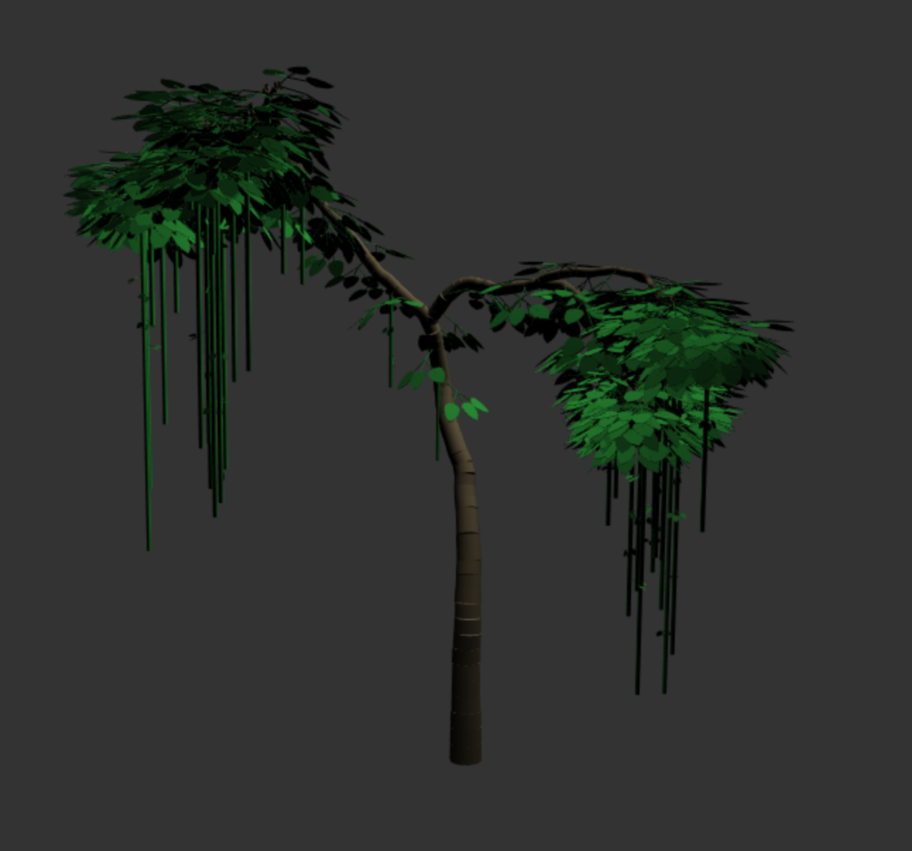
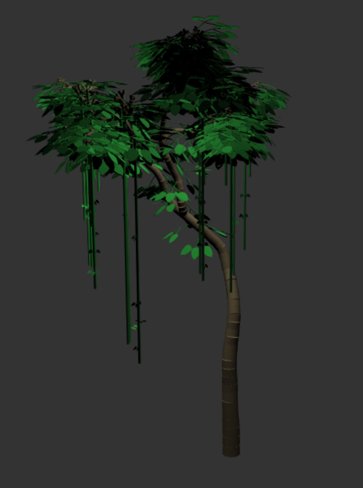
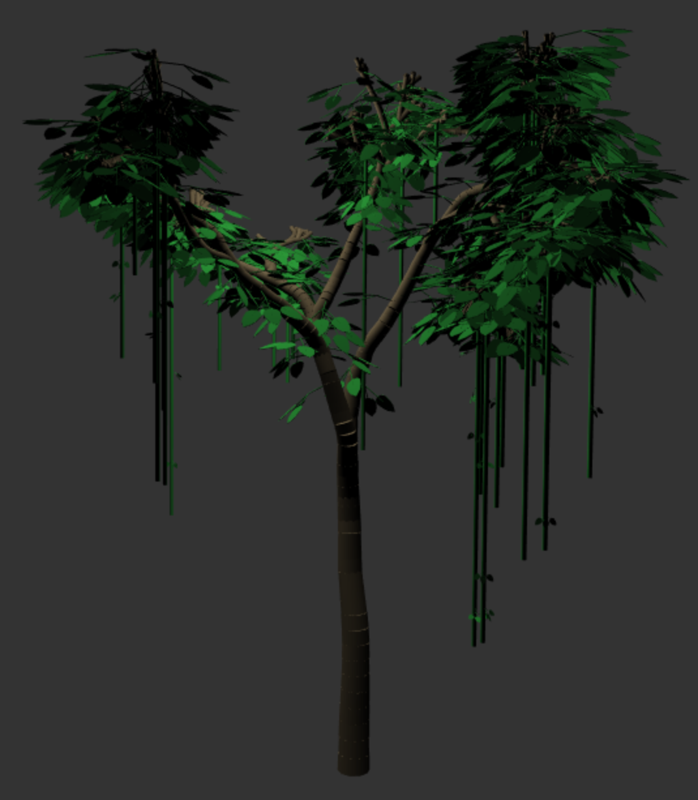

# CIS-566-Project-4

I composed my tree out of three pieces of geometry. The trunk is made of small slightly-tapered cylinders. the vines are cylinders, and the leaves are modeled meshes of three leaves on a thin branch. The lsystem itself contains a rule book as a string to string array map. If a character in the instructions string is a key in the rules map, the lsystem will randomly select one of the strings in the corresponding string array to replace it with. The characters are as follows. F generates a trunk piece. R randomly rotates the turtle about its relative yaw and pitch. "+" and "-" also randomly rotate the turtle, but to a greater degree than R does. They each bias towards the opposite direction to more easily allow for v-shape branching points in the tree. [" and "]" push and pop turtles on the stack to save branching point locations. "." indicates a branching point. L has a chance of generating a leaf mesh. V has a chance of generating a vine mesh. Both leaves and vines are more likely to generate the deeper the current turtle is in order to distribute them towards the top of the tree. F can expand to itself, itself plus a vine, itself plus a leaf, and twice of itself. "." can expand to a branch to the right or to the left. Leaves and vines generate at the position of the current turtle, but not with its rotation or scale. This allows for their rotations and scales to be controlled independently to create leaves that face the sky and vines that hang directly downward. The length of each vine is also randomly determined.

Demo: https://bobmowzie.github.io/homework-4-l-systems-BobMowzie/

